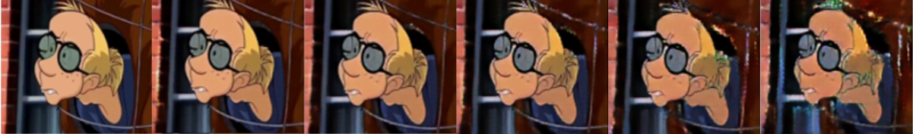

# **Pix2Gif**

## **Abstract**
In this project we experimented with the Pix2Pix framework to extend it for generating short videos (gifs) from a single input frame. Although Pix2Pix is successful in image-to-image translation tasks, our experiments show that generating coherent videos from a single image in a similar architecture is a much more complex task and presents additional significant challenges. We present our method of approach, discuss the major stepping stones, results, and the challenges we encountered for potential future research to improve performance in this application.

## **Introduction**
Pix2Pix framework is a model for converting images from one type to another using Generative Adversarial Networks. Consist of two neural networks, a generator that creates images and a discriminator that learns to tell real images apart from generated ones and acts as a custom loss function. They are trained together in a way that improves the quality of the generated images over time.

Pix2Pix uses a conditional GAN where both the generator and the discriminator are given the input image to condition on. This helps the model learn to translate a specific input image into a desired output image. The generator in Pix2Pix often uses a U-Net architecture, which includes an encoder-decoder structure with skip connections to retain high-resolution details from the input image. The discriminator uses a PatchGAN approach, focusing on small patches of the image to ensure fine details and textures are realistic.

This framework has been successfully applied to different tasks such as turning sketches into photos, aerial images into maps, and black-and-white photos into color images. However, extending Pix2Pix to generate videos from a single input image introduces new challenges. Video generation requires maintaining consistency and smooth transitions across multiple frames, which is more complex than generating a single image.

In this project, we experimented with adapting Pix2Pix to create short videos from a single image. We explored several methods and datasets, facing significant challenges in achieving realistic and coherent video sequences. This paper details our experiments, results, and potential future directions to improve image-to-video generation.

## **Method 1 - Trivial approach**

Our first attempt was a simple method to serve as a base model. We took our dataset of gifs and split it into pairs of consecutive  frames {Freal i, Freal i+1} for training, where Freal i served as the input and Freal i+1 was the target frame the generator had to learn to imitate. For generating a whole video we iteratively activated the model, meaning:    Fgenerated i+1=G(Fgenerated i)    for: i>0  and Fgenerated 1=F0

We applied this method on a dataset of cartoons we scraped from Giphy and quickly realized that the model was generating very blurry and distorted frames. Each frame generation added some “noise” because the model couldn’t create images perfectly.

After reviewing our results, we changed the input we fed to the model. Instead of giving it only pairs of 2 real images as in the previous experiment, we created our pairs in the following way:    {Freal 0, Freal 1}, {Fgenerated 1, Freal 2}, ..., {Fgenerated i, Freal i+1}

This approach gave us much more concise results in terms of sharpness because the model was trained in a way that requires it to understand some images might contain noise in them and not recreate the added noise in the synthesized output. Despite the better performance in recreating the image for a few iterations the model still didn’t generate any noticeable movement.

## **Method 2 - RNN**

The two previous experiments led us to understand that the model was just trying to recreate the image without adding any movement on top of it. Therefore, we decided to change to model architecture to work as a simple Recurrent Neural Network (RNN) and expand some of its hidden layers. This way the model will have some context of his previous input, potentially helping to create more movement in the generated images. 

The modified RNN-based model generated sharper images with less noise, but it still failed to produce real movement. Occasionally, it would generate random objects, but consistent motion was not achieved.

## **Method 3**

At this point we realized that gifs of cartoons are way too random and unpredictable. Some gifs could be only a blinking character while another can have a flying car that shoots and blows stuff up. To create a model that will be able to generalize so many things the model will probably have to be astronomically larger. Because it is already very big, we decided to try and switch to a different video domain, so we created a new dataset of only 364 gifs from Giphy containing waterfalls that were manually filtered, that way our dataset consists of gifs with much more predictable motion. 

In addition, we redesigned the model to better support texture motion. The new redesign included expanding the input and output frames size since texture movement is almost invisible in small frames. In addition to that instead of iteratively running the model for each input/output we inflated the inner “feature” layer to be 3 dimensional and changed all the convolutions to be 3D convolution instead of 2D. This way the convolution kernels are responsible for creating the texture movement for the water for all dimensions (frames) simultaneously. We also had to change the discriminator in a way it will now receive an image and a video (24 frames) and will need to tell apart between a real video and synthesized video. This was the first time we managed to get some movement that resembled something real and concise.

## **Results**

When reviewing the model results it is visible the model is generating coherent results, they are still somewhat blurry, but they are not distorted. 

  

We can see the model is able to detect the areas where the motion happens, but it still has some trouble creating smooth motion.

## **Main Challenges**
Our biggest challenge was the computational power he had to use for this project. We used an online GPU of type L4 we bought in Google Colab. Each experiment had to run for a long time until it started to show some results. For example, the results from Method 3 are after about 8 hours of training the model.  Since the experiment required an input and output size of at least 240 x 240 pixels the model weighs 355 Mb and even on the L4 GPU we could use only a batch size of 8. In addition, since we switched between multiple methods and datasets, we finished the budget we allocated for this project and couldn’t continue training the model or testing different hyper-parameters to make sure we don’t have better results for our suggested architecture.

The second big problem was understanding the dataset. We initially chose the cartoon's dataset because we thought it would be relatively easy, not containing a lot of details in the frames and having a simple color scheme. We didn’t anticipate the unpredictable movement we would have to deal with. Because of that we had to recollect and change our dataset in the middle of the project.
